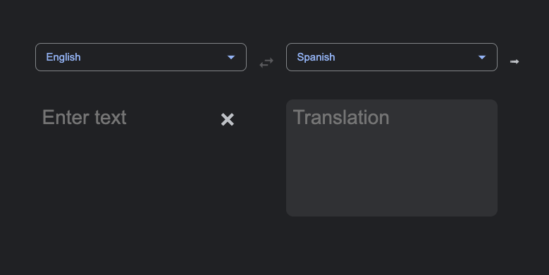

# Google Translate Clone
  

  ## Description
  This app is a simple clone of Google translate. You can translate to or from around 200 languages.

  ## Installation
  To run in development, install dependencies, and get API keys from (insert link). Remember to put API keys in an env file.

  ## Usage
  See deployed version here: (https://google-translate-clone22.herokuapp.com/)
  

  ## License
    
  This project uses  the [MIT](https://opensource.org/licenses/MIT) license.

  ## Questions
  Reach out via email or GitHub.  
  cassie.s.simpson@gmail.com  
  [cassie-s](https://github.com/cassie-s/)

  

